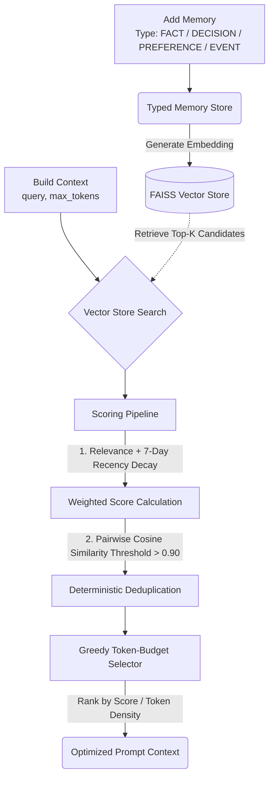

# Context Scheduler

A deterministic context optimization layer for LLM applications that decides what memories a model should see under a strict token budget—scoring relevance and recency, purging semantic duplicates, and greedily packing the highest-density facts.

Much like an operating system scheduler allocates scarce CPU cycles among competing processes, the **Context Scheduler** allocates a fixed prompt token budget among competing conversation memories to maximize factual density without exceeding context constraints.

---

## The Problem

LLMs have finite context windows, and packing them with raw conversation history causes linear cost growth, increased time-to-first-token, and "lost-in-the-middle" attention degradation. Sliding-window truncation drops critical past decisions, while standard Vector RAG retrieves purely on semantic similarity—blindly pulling outdated facts and duplicate memories that exhaust the token budget on repetitive noise.

The Context Scheduler solves this by applying a four-stage heuristic pipeline: typed ingestion, relevance and time-decay scoring, pairwise semantic deduplication, and greedy knapsack budget allocation.

---

## Architecture



---

## Quickstart & API Usage

> *Note: The Python package path retains the original project name `context_engine`.*

### Installation
```bash
pip install sentence-transformers faiss-cpu tiktoken litellm pandas matplotlib pytest python-dotenv
```

### Basic Usage
```python
from context_engine import Context

# Initialize context store for a user
ctx = Context(user_id="user_123")

# Ingest typed memories
ctx.add("The team decided to migrate our database to PostgreSQL.", type="DECISION")
ctx.add("User prefers concise technical responses with code snippets.", type="PREFERENCE")
ctx.add("PostgreSQL migration completed successfully.", type="EVENT")
ctx.add("Normal API latency on the auth service is 45ms.", type="FACT")

# Build optimized context under a strict token ceiling
prompt_context = ctx.build(
    query="Why did we choose PostgreSQL and what is our database setup?", 
    max_tokens=500
)

print(prompt_context)
```

---

## Benchmark Results

Evaluated on an $N=30$ synthetic benchmark containing multi-hop reasoning, recency conflicts, and duplicate overload (1.33 average required memories per question; 10 multi-hop queries). Evaluated using a two-pass LLM-as-a-judge (`openai/gpt-oss-120b` via Groq) at temperature 0.0.

### In-Sample Results (Seed=42, Budget=50 tokens)

| Method | N | Precision | Recall | Token Reduction | LLM Accuracy | Total Latency | Engine Overhead |
| :--- | :---: | :---: | :---: | :---: | :---: | :---: | :---: |
| **Context Scheduler** | **30** | **0.3667 (36.7%)** | **0.8667 (86.7%)** | **0.8296 (83.0%)** | **1.0000 (100.0%)** | **0.0156s** | **0.0016s** |
| **Vector RAG** | 30 | 0.3056 (30.6%) | 0.8333 (83.3%) | 0.8050 (80.5%) | 1.0000 (100.0%) | 0.0140s | 0.0000s |
| **Naive Truncation** | 30 | 0.1667 (16.7%) | 0.6667 (66.7%) | 0.7970 (79.7%) | 0.6667 (66.7%) | 0.0007s | 0.0000s |
| **Full History** | 30 | 0.0695 (6.9%) | 1.0000 (100.0%) | 0.0000 (0.0%) | 1.0000 (100.0%) | 0.0000s | 0.0000s |

- **Vs. Full History:** Delivers an **83.0% token reduction** and raises precision from 6.9% to 36.7% (a 5x increase in signal density) with 100% LLM accuracy.
- **Vs. Naive Truncation:** Truncating history causes recall to collapse to 66.7% and accuracy to 66.7% because older critical facts are discarded. Context Scheduler maintains 86.7% recall and 100% accuracy.
- **Vs. Vector RAG:** Context Scheduler outperforms Vector RAG on **recall (86.7% vs. 83.3%)**, **precision (36.7% vs. 30.6%)**, and **token reduction (83.0% vs. 80.5%)** by eliminating redundant copies of facts and penalizing outdated information at an engine overhead of just **1.6 milliseconds**.

---

### Held-Out Cross-Validation (Seed=123)

To ensure the scoring weights and 7-day half-life were not overfit to the tuning set, the full pipeline was validated against an unseen dataset (`seed=123`):

| Test Set | Method | Recall | Precision | Token Reduction | LLM Accuracy | Engine Overhead |
| :--- | :--- | :---: | :---: | :---: | :---: | :---: |
| **In-Sample (Seed 42)** | **Context Scheduler** | **86.7%** | **36.7%** | **83.0%** | **100.0%** | **0.0016s** |
| | Vector RAG | 83.3% | 30.6% | 80.5% | 100.0% | 0.0000s |
| **Held-Out (Seed 123)** | **Context Scheduler** | **86.7%** | **35.6%** | **82.5%** | **100.0%** | **0.0017s** |
| | Vector RAG | 83.3% | 30.6% | 80.5% | 100.0% | 0.0000s |

The performance advantage generalizes across seeds: Context Scheduler consistently achieves higher recall (+3.4%), higher precision (+5.0% to +6.1% points), and lower token consumption (+2.0% to +2.5%) than Vector RAG.

---

### Token Budget Sweep (Pareto Frontier)

We swept all methods across token budgets from 25 to 500 tokens:

| Budget (max_tokens) | CS Recall | CS Precision | CS Token Reduction | RAG Recall | RAG Precision | RAG Token Reduction |
| :---: | :---: | :---: | :---: | :---: | :---: | :---: |
| **25** | 65.0% | **41.7%** | **90.2%** | 75.0% | 48.3% | 89.9% |
| **50** (v1 Budget) | **86.7%** | **36.7%** | **83.0%** | 83.3% | 30.6% | 80.5% |
| **75** | **86.7%** | **28.4%** | **77.1%** | 83.3% | 19.8% | 70.0% |
| **100** | **86.7%** | **26.6%** | **73.6%** | 83.3% | 14.5% | 57.8% |
| **150** | 86.7% | **26.3%** | **72.6%** | 100.0% | 11.5% | 37.7% |
| **250** | 86.7% | **26.3%** | **72.6%** | 100.0% | 7.2% | 4.9% |
| **500** | 86.7% | **26.3%** | **72.6%** | 100.0% | 6.9% | 0.0% |

**Key Takeaway:** As the token budget expands (150 $\rightarrow$ 500 tokens), Vector RAG degenerates into full-history dumping (token reduction falls to 0.0% and precision collapses to 6.9%). Context Scheduler **caps token reduction at 72.6%** and preserves **26.3% precision**, refusing to pack redundant or irrelevant memories even when extra token capacity is available.

---

## What We Found: Key Debugging Insights

During development, rigorous failure analysis revealed critical architectural subtleties:

1. **Recency Timescale Mismatch:** Initial evaluations failed on recency-conflict queries. Investigation revealed that the synthetic dataset placed memories 30 days in the past, while the scoring pipeline used an uncalibrated 24-hour half-life. Because $e^{-\lambda \times 29\text{ days}} \approx 0.0$, the recency term collapsed to zero, letting raw semantic similarity dominate. Calibrating the half-life to 7 days (168 hours) activated temporal ranking, resolving the dropped questions and lifting recall from 80.0% to 86.7%.
2. **LLM Judge Rate Limiting & Error Propagation:** Under free-tier API rate limits (30 RPM), sequential evaluation calls initially suffered from rate-limit hangs or risk of silent default fallbacks. We implemented 2.1-second request pacing, capped exponential retries, and explicit `np.nan` error propagation to prevent skewed averages.
3. **Deterministic Reproducibility:** Fixed sample index averaging bugs (`Sample: 15.5` $\rightarrow$ `N: 30`) and locked procedural dataset generation with explicit random seeds to achieve bit-for-bit reproducibility.

*For an exhaustive breakdown of the design decisions, component trade-offs, and failure diagnoses, see [notes.md](notes.md).*

---

## Scope & Intentional Limitations

The following capabilities were explicitly deferred from v1 to control architectural complexity:

- **No Active Contradiction Detection:** Outdated facts are downweighted passively via time decay rather than actively purged or tombstoned using an upstream NLI/LLM classifier.
- **No Causal Dependency Graphs:** Multi-hop retrieval relies on semantic vector overlap; explicit graph edges linking antecedent memories were deferred.
- **No Multi-Level Summarization:** Memories are stored as discrete units rather than recursively summarized into hierarchical episodes or topics.
- **In-Memory Store:** Uses local FAISS (`IndexFlatIP`) for sub-millisecond evaluation. Production scale ($>10^6$ memories) would require a persistent vector database with HNSW indexing.
- **Package Naming:** The Python import path is `context_engine`, which reflects the project's original working name before the display title was finalized as Context Scheduler.

---

## Tech Stack

- **Core Logic:** Python 3.10+
- **Embedding Model:** `sentence-transformers` (`all-MiniLM-L6-v2`, 384-dimensional dense vectors)
- **Vector Search:** `faiss-cpu` (`IndexFlatIP` on normalized vectors)
- **Tokenizer:** `tiktoken` (`cl100k_base` BPE encoding)
- **Evaluation & LLM Judge:** `litellm` routed to Groq (`openai/gpt-oss-120b`), `pandas`, `matplotlib`

---

## Running Evaluations

### 1. Configure Environment
Create a `.env` file in the project root containing your Groq API key:
```env
GROQ_API_KEY=your_groq_api_key_here
```

### 2. Run the Benchmark Evaluation (N=30)
```bash
python eval/run_evals.py --seed 42
```
To run on the held-out test set:
```bash
python eval/run_evals.py --seed 123
```
*Outputs a performance table to the terminal, writes metrics to `eval_results.csv`, and saves `eval_chart.png`.*

### 3. Run the Token Budget Sweep
```bash
python eval/token_budget_sweep.py
```
*Evaluates budgets from 25 to 500 tokens, outputs `budget_sweep_results.csv`, and generates `budget_sweep_chart.png`.*
