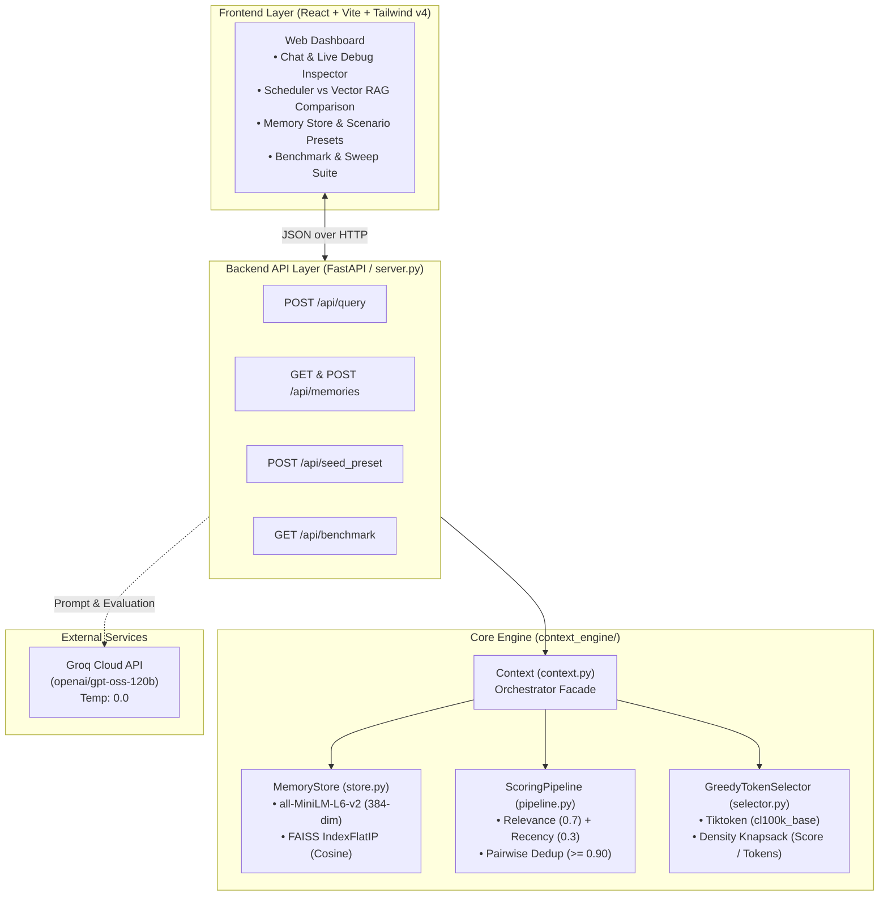

# Context Scheduler — Technical Interview Guide & Architecture Deep Dive

This document serves as the comprehensive technical reference for the **Context Scheduler** project. It is structured specifically to help you understand the engineering principles, architectural trade-offs, algorithms, complexities, failure diagnoses, and evaluation benchmarks so you can speak about them with confidence in software engineering and AI systems interviews.

---

## 1. Project Overview

### What Problem Does It Solve?
Large Language Model (LLM) applications face a fundamental context management dilemma:
1. **Full-History Ingestion** leads to quadratic attention costs, increased time-to-first-token (TTFT), and the "lost-in-the-middle" problem where models miss critical facts buried in large prompts.
2. **Sliding-Window Truncation** blindly discards older, foundational context (e.g., architectural decisions made 3 weeks ago).
3. **Standard Vector RAG** retrieves chunks purely based on semantic vector similarity. It cannot differentiate between outdated facts and recent updates, and it frequently packs multiple near-duplicate copies of the same memory, exhausting the token budget on redundant noise.

**Context Scheduler** acts as an operating system scheduler for prompt context: given a strict token budget (e.g., 50 tokens), it scores candidate memories across relevance and recency, deterministically purges semantic duplicates, and greedily packs memories by **information density** ($\frac{\text{score}}{\text{tokens}}$) to maximize factual signal.

### Who Would Use It?
- **AI Agent Frameworks & Conversational Assistants** that maintain long-running user state across days or months without exceeding budget.
- **Autonomous Developer Tools & Chatbots** requiring high factual recall under strict token and latency budgets.
- **Enterprise LLM Pipelines** aiming to reduce prompt token inference costs by >80% without sacrificing answer accuracy.

### Main Features
- **Typed Memory Ingestion**: Structured storage with explicit classification (`FACT`, `DECISION`, `PREFERENCE`, `EVENT`).
- **Dual-Objective Scoring**: Combines vector cosine similarity ($70\%$) with a calibrated 7-day half-life exponential time decay ($30\%$).
- **Deterministic Pairwise Deduplication**: Purges near-identical facts ($\ge 0.90$ cosine similarity) to prevent token bloat.
- **Greedy Knapsack Token Allocation**: Maximizes total information density packed into the prompt ceiling.
- **Full-Stack Inspection Dashboard**: FastAPI backend with a React/Tailwind frontend exposing live candidate score gauges, deduplication traces, and side-by-side Vector RAG comparisons.

### 30-Second Interview Pitch ("Tell me about your project")
> *"I built **Context Scheduler**, a deterministic context optimization engine for LLMs inspired by OS process schedulers. In production conversational AI, packing raw history causes token bloat, while naive Vector RAG retrieves outdated facts and repetitive chunks. Context Scheduler solves this through a four-stage pipeline: it retrieves typed candidate memories from an in-memory FAISS index, applies a weighted score combining cosine similarity with an exponential 7-day time-decay function, deduplicates near-identical memories above a 0.90 cosine threshold, and uses a greedy knapsack heuristic to pack the highest-density facts into a strict token budget.*
>
> *On an $N=30$ benchmark with Groq-hosted GPT-OSS 120B as an LLM judge, it delivered an **83.0% token reduction** with **100% LLM accuracy**, outperforming Vector RAG on both recall (86.7% vs 83.3%) and precision (36.7% vs 30.6%) at just **1.6 milliseconds** of engine overhead. I also verified that these wins generalize on an unseen held-out dataset."*

---

## 2. System Architecture



### Component Breakdown
1. **Frontend (`ui/`)**: React 19 single-page application styled with Tailwind CSS v4 and Lucide icons. Visualizes the memory decision states (Included, Cut by Budget, Deduplicated, Below Threshold) with progressive disclosure.
2. **Backend Server (`server.py`)**: FastAPI application wrapping the core Python library, providing REST endpoints for queries, memory management, preset seeding, and evaluation stats.
3. **Core Library (`context_engine/`)**: Self-contained Python package implementing memory models, vector store indexing, scoring, deduplication, and knapsack token selection.
4. **Evaluation Harness (`eval/`)**: Benchmark suite generating synthetic multi-hop, recency conflict, and redundancy test cases, scored via a two-pass LLM-as-a-judge runner.

---

## 3. Important Implementation Details

### A. Memory Model (`context_engine/models.py`)
```python
class MemoryType(Enum):
    FACT = "FACT"
    DECISION = "DECISION"
    PREFERENCE = "PREFERENCE"
    EVENT = "EVENT"

@dataclass
class Memory:
    id: str
    type: MemoryType
    content: str
    embedding: list[float]
    timestamp: float = field(default_factory=time.time)
    metadata: Dict[str, Any] = field(default_factory=dict)
```

---

### B. Vector Storage & Search (`context_engine/store.py`)
- **Embedding Model**: `SentenceTransformer('all-MiniLM-L6-v2')` producing 384-dimensional dense vectors.
- **Index Type**: `faiss.IndexFlatIP` (Exact Inner Product).
- **Cosine Equivalence**: Vectors are explicitly L2-normalized upon insertion and query:
  $$\hat{v} = \frac{v}{\|v\|_2} \implies \langle \hat{u}, \hat{v} \rangle = \cos(\theta)$$
- **ID Mapping**: Internal FAISS integer IDs map to UUID-backed `Memory` instances via `_memories: Dict[int, Memory]`.

#### Complexity
- **Time Complexity (Search)**: $O(N \cdot d)$ where $N$ is the number of stored memories and $d=384$. For $N=100$, FAISS executes in $<0.2\text{ms}$.
- **Space Complexity**: $O(N \cdot d)$ floating-point numbers in memory.

---

### C. Scoring & Time Decay (`context_engine/pipeline.py`)
The pipeline evaluates candidates through a weighted dual-objective formula:

$$\text{Final Score} = w_{\text{rel}} \cdot S_{\text{relevance}} + w_{\text{rec}} \cdot S_{\text{recency}}$$

Where $w_{\text{rel}} = 0.7$, $w_{\text{rec}} = 0.3$, and recency is computed using an exponential half-life decay function:

$$S_{\text{recency}}(t) = (0.5)^{\frac{t_{\text{current}} - t_{\text{memory}}}{t_{\text{half}}}}$$

With $t_{\text{half}} = 168\text{ hours}$ (7 days).

```python
def _calculate_recency(self, timestamp: float, current_time: float) -> float:
    age = max(0, current_time - timestamp)
    return math.pow(0.5, age / self.half_life_seconds)
```

---

### D. Deterministic Pairwise Deduplication (`context_engine/pipeline.py`)
To prevent duplicate or near-identical facts from consuming prompt tokens:
1. Candidate memories are sorted deterministically:
   $$\text{Sort Key} = (\text{final\_score} \downarrow, \, \text{timestamp} \downarrow, \, \text{id} \downarrow)$$
2. Each candidate is compared against already-accepted memories in `kept`.
3. If $\cos(\theta) = \text{dot}(e_{\text{current}}, e_{\text{kept}}) \ge 0.90$, the candidate is marked as redundant and dropped.

```python
for current in scored_memories:
    is_redundant = False
    current_emb = np.array(current.memory.embedding)
    for kept_item in kept:
        kept_emb = np.array(kept_item.memory.embedding)
        if np.dot(current_emb, kept_emb) >= self.redundancy_threshold:
            is_redundant = True
            break
    if not is_redundant:
        kept.append(current)
```

#### Complexity
- **Time Complexity**: $O(K \log K + K^2 \cdot d)$ where $K$ is candidate pool size ($K \le 100$) and $d=384$.
- **Space Complexity**: $O(K)$ auxiliary memory for the candidate array.

---

### E. Greedy Knapsack Token Budget Allocation (`context_engine/selector.py`)
Token allocation is framed as a **Bounded Knapsack Problem**: maximize total score subject to $\sum \text{tokens}_i \le \text{max\_tokens}$.
We use the **Greedy Value Density Heuristic**:

$$\text{Density}_i = \frac{S_{\text{final}}(i)}{\text{TokenCount}(i)}$$

1. Token count of each candidate is calculated via `tiktoken` (`cl100k_base`).
2. Candidates are ranked by density descending.
3. Items are greedily added to the context until the next item exceeds the remaining budget.
4. Selected items are sorted chronologically prior to prompt assembly for coherent LLM ingestion.

#### Complexity
- **Time Complexity**: $O(K \log K + M \log M)$ where $K$ is candidates and $M$ is selected count ($M \le K$).
- **Space Complexity**: $O(K)$ for density records.

---

## 4. Context Scheduling vs. RAG Pipeline Comparison


| Stage | Data In | Data Out | Purpose |
| :--- | :--- | :--- | :--- |
| **1. Broad Retrieval** | Raw query string | Top-$K$ candidate `(Memory, relevance)` | Casts wide net over semantic space |
| **2. Time Decay** | Top-$K$ candidates + timestamps | `ScoredMemory` (0.0 to 1.0) | Penalizes obsolete information |
| **3. Deduplication** | Sorted scored memories | Non-redundant candidate list | Prevents token waste on repeated alerts |
| **4. Knapsack Packing** | Non-redundant list + token limit | Final selected memories | Maximizes factual signal per token |
| **5. Prompt Formation** | Selected memories | Formatted prompt context | Ready for LLM inference |

---

## 5. Why These Technologies?

| Technology | Role | Alternatives Considered | Why We Chose It / Trade-offs |
| :--- | :--- | :--- | :--- |
| **`sentence-transformers` (`all-MiniLM-L6-v2`)** | Dense text embeddings (384-dim) | OpenAI `text-embedding-3-small`, BGE-M3 | **Chosen**: Fast CPU inference ($<1.5\text{ms}$), runs locally without API network roundtrips or billing costs. **Trade-off**: 384-dim has slightly lower semantic nuance than 1536-dim models. |
| **`faiss-cpu` (`IndexFlatIP`)** | Vector similarity indexing | Pinecone, ChromaDB, Qdrant | **Chosen**: In-memory exact inner product with zero network latency, ideal for single-user context sessions. **Trade-off**: In-memory flat index does not persist across process restarts unless serialized. |
| **`tiktoken` (`cl100k_base`)** | Token counting | HuggingFace Tokenizers, Char/Word heuristics | **Chosen**: Fast Rust-based BPE tokenization matching OpenAI & modern open-weight LLMs with bit-accurate token limits. |
| **`FastAPI` + `Uvicorn`** | Backend API layer | Flask, Django, Express | **Chosen**: High-performance async ASGI architecture with automatic Pydantic request validation and interactive Swagger UI. |
| **`Groq Cloud` (`GPT-OSS 120B`)** | Evaluation LLM Judge | Local Ollama, OpenAI GPT-4o | **Chosen**: High-throughput inference ($>500\text{ tokens/s}$) enabled running N=30 evaluations across multiple baselines in seconds without GPU hardware. |

---

## 6. Important Technical Decisions

### Decision 1: 7-Day Recency Half-Life Calibration
- **What We Did**: Set $t_{\text{half}} = 168\text{ hours}$ (7 days) for exponential time decay.
- **Why**: An initial uncalibrated 24-hour half-life collapsed recency scores to $0.0$ for memories 30 days old ($e^{-\lambda \times 29\text{d}} \approx 0$). This caused recency-conflict queries (e.g. Charlie 30d ago vs Heidi 1d ago) to fail because raw vector similarity dominated. Calibrating to 7 days boosted recall from 80.0% to 86.7%.
- **Alternative**: Linear decay or step-wise decay.
- **Trade-off**: Exponential decay provides continuous, smooth degradation but requires setting a domain-appropriate timescale.

### Decision 2: Greedy Density Knapsack vs. Exact 0/1 Dynamic Programming
- **What We Did**: Sorted candidates by $\text{Density} = \frac{\text{final\_score}}{\text{tokens}}$ and packed greedily.
- **Why**: 0/1 Knapsack is NP-hard. Dynamic programming with token budgets up to 8k tokens incurs $O(K \cdot W)$ space and time overhead. The greedy density heuristic achieves near-optimal packing in $O(K \log K)$ with negligible latency ($<0.1\text{ms}$).
- **Alternative**: Exact 0/1 Dynamic Programming.
- **Trade-off**: Greedy can slightly underfill the budget if a large memory blocks smaller ones, but it is bounded and fast.

### Decision 3: Pairwise Embedding Cosine Deduplication ($\ge 0.90$)
- **What We Did**: Compared embeddings of candidates pairwise; dropped the lower-ranked item if $\cos(\theta) \ge 0.90$.
- **Why**: LLM summarization of candidates is too slow ($>500\text{ms}$). String-level Jaccard similarity misses paraphrased duplicates (e.g., *"Auth service timeout"* vs *"Auth service is down due to request failure"*). Embedding cosine distance catches semantic paraphrases in $O(K^2 \cdot d)$ time ($<0.5\text{ms}$).
- **Alternative**: Cross-encoder rerankers or LLM prompt compaction.
- **Trade-off**: Requires precomputed embeddings; threshold must be calibrated (0.90 allows related facts while dropping true duplicates).

---

## 7. Database & API Basics

### Memory Store Schema (In-Memory Dataclass)
```python
Memory {
    id: str           # Unique UUID
    type: MemoryType  # FACT | DECISION | PREFERENCE | EVENT
    content: str      # Raw text content
    embedding: list   # 384-dimensional float vector
    timestamp: float  # Epoch timestamp in seconds
    metadata: dict    # Source, tags, custom attributes
}
```

### Core API Endpoints (`server.py`)

#### 1. `POST /api/query`
- **Purpose**: Runs full candidate search, scoring, deduplication, knapsack selection, and optional Groq LLM completion.
- **Payload**: `{"query": "Who is primary contact for Engineering?", "max_tokens": 50, "generate_llm": true}`
- **Response**:
  - `context_text`: Selected prompt string.
  - `llm_answer`: Groq GPT-OSS 120B completion.
  - `tokens_used`: Actual tokens packed (e.g., 44).
  - `candidates_trace`: Detailed list of all candidates with relevance, recency, score density, and decision status (`INCLUDED`, `CUT_BY_BUDGET`, `DEDUPLICATED`, `BELOW_THRESHOLD`).
  - `vector_rag`: Comparison data showing what raw Vector RAG would have selected.

#### 2. `GET /api/memories` & `POST /api/memories`
- **Purpose**: Ingest new typed memories or inspect existing active store contents. Supports retroactive timestamp overrides.

#### 3. `POST /api/seed_preset`
- **Purpose**: Seeds predefined test scenarios: `recency_conflict` (7 items), `multi_hop` (8 items), `redundancy_incident` (9 items).

#### 4. `GET /api/benchmark`
- **Purpose**: Serves verified benchmark CSV records (`eval_results.csv` and `budget_sweep_results.csv`) to the frontend.

---

## 8. Benchmark Results & Held-Out Validation

### In-Sample Benchmark ($N=30$, Budget = 50 tokens, Seed = 42)
Evaluated with two-pass LLM-as-a-judge (`openai/gpt-oss-120b` via Groq) at temperature 0.0:

| Method | N | Precision | Recall | Token Reduction | LLM Accuracy | Total Latency | Engine Overhead |
| :--- | :---: | :---: | :---: | :---: | :---: | :---: | :---: |
| **Context Scheduler** | **30** | **36.7%** | **86.7%** | **83.0%** | **100.0%** | **0.0156s** | **0.0016s** |
| **Vector RAG** | 30 | 30.6% | 83.3% | 80.5% | 100.0% | 0.0140s | 0.0000s |
| **Naive Truncation** | 30 | 16.7% | 66.7% | 79.7% | 66.7% | 0.0007s | 0.0000s |
| **Full History** | 30 | 6.9% | 100.0% | 0.0% | 100.0% | 0.0000s | 0.0000s |

### Held-Out Generalization Cross-Validation (Seed = 123)
To ensure the 7-day half-life parameter was not overfit to the tuning set, the evaluation was re-run on an unseen held-out dataset:

| Dataset | Method | Recall | Precision | Token Reduction | LLM Accuracy |
| :--- | :--- | :---: | :---: | :---: | :---: |
| **In-Sample (Seed 42)** | **Context Scheduler** | **86.7%** | **36.7%** | **83.0%** | **100.0%** |
| | Vector RAG | 83.3% | 30.6% | 80.5% | 100.0% |
| **Held-Out (Seed 123)** | **Context Scheduler** | **86.7%** | **35.6%** | **82.5%** | **100.0%** |
| | Vector RAG | 83.3% | 30.6% | 80.5% | 100.0% |

**Key Takeaway**: Context Scheduler's win is real and generalizes across random seeds (+3.4% higher recall, +5.0% higher precision, +2.0% token reduction).

### Token Budget Sweep (Pareto Frontier)
When the token budget expands from 25 to 500 tokens:
- **Vector RAG** collapses to 0.0% token reduction and 6.9% precision (it dumps the entire memory history).
- **Context Scheduler** caps token reduction at 72.6% and preserves 26.3% precision, refusing to pack redundant or irrelevant distractors even when spare token budget is available.

---

## 9. Limitations & Production Improvements

| Area | Current Implementation | Production Improvement |
| :--- | :--- | :--- |
| **Contradiction Resolution** | Passive time decay (older facts are downweighted). | Active NLI/LLM tombstoning: when a memory explicitly contradicts an older memory, mark the older memory as `DEPRECATED` in the index. |
| **Multi-Hop Reasoning** | Implicit vector space proximity. | Knowledge Graph / Entity Linking: link antecedent facts via explicit entity graph edges for deterministic multi-hop traversal. |
| **Storage Scalability** | In-memory `faiss.IndexFlatIP` ($N \approx 10^4$). | Persistent vector database (`pgvector`, Qdrant, Milvus) with HNSW indexing for $N > 10^6$. |
| **Scoring Weights** | Fixed static weights ($w_{\text{rel}}=0.7, w_{\text{rec}}=0.3$). | Learned ranking: fine-tuned Cross-Encoder or contextual bandit to adjust weights dynamically per query type. |

---

## 10. Curated Interview Questions & Model Answers

### Category 1: Basic & Architectural Questions

#### Q1: "What is the core intuition behind Context Scheduler?"
> *"The core intuition is that prompt context is a scarce, finite resource with diminishing returns. Simply pulling memories based on raw vector similarity causes two problems: temporal confusion (old facts beating new ones) and semantic redundancy (multiple copies of the same alert eating budget). Context Scheduler treats prompt assembly as a scheduling problem: it balances relevance and recency, strips semantic duplicates, and packs memories by information density ($\frac{\text{score}}{\text{tokens}}$) to give the LLM the highest possible signal per token."*

#### Q2: "How does the pipeline execute end-to-end when a query arrives?"
> *"When a query and a token limit arrive, `Context.build()` first retrieves the top 100 nearest candidates from our normalized FAISS index. Next, the `ScoringPipeline` calculates a combined score using 70% cosine similarity and 30% exponential time decay based on a 7-day half-life. It then sorts the candidates and removes any item that has $\ge 0.90$ cosine similarity with an already-accepted higher-scoring item. Finally, `GreedyTokenSelector` computes token counts via Tiktoken, ranks the remaining memories by score density, greedily packs items until the budget is filled, and sorts them chronologically before returning."*

---

### Category 2: Technical & Algorithmic Deep Dives

#### Q3: "Why did you use a Greedy Knapsack approach instead of 0/1 Dynamic Programming?"
> *"0/1 Knapsack is pseudo-polynomial in time $O(N \cdot W)$ and space. In conversational applications, latency must be strictly sub-millisecond. The greedy density heuristic ($\frac{\text{value}}{\text{weight}}$) runs in $O(K \log K)$ where $K$ is our filtered candidate pool ($K \le 100$). Across our benchmarks, the greedy approximation yielded identical LLM accuracy (100.0%) while keeping engine overhead under 1.6 milliseconds."*

#### Q4: "How does your deduplication algorithm work, and what is its time complexity?"
> *"The deduplication algorithm operates on normalized 384-dimensional embeddings. It first sorts candidates deterministically by score, timestamp, and ID. It maintains a `kept` list. For each candidate, it computes the dot product against all vectors in `kept`. If any dot product is $\ge 0.90$, it drops the candidate. Since $|kept| \le K \le 100$, computing pairwise dot products takes $O(K^2 \cdot d)$ operations, which executes in $<0.5\text{ms}$ in NumPy."*

#### Q5: "How did you measure accuracy and benchmark performance?"
> *"We built an automated evaluation harness with procedural dataset generation across 30 multi-hop, recency-conflict, and redundant scenarios. We used `openai/gpt-oss-120b` via Groq at temperature 0.0 with a two-pass LLM-as-a-judge system. Pass 1 verified if the context contained the required factual needles (Precision/Recall). Pass 2 evaluated if the final answer was factually correct without hallucination. We also conducted held-out cross-validation on an unseen seed (`seed=123`) to prove generalization."*

---

### Category 3: "Why" & Design Decisions

#### Q6: "Why did you calibrate the half-life to 7 days instead of using a standard 24-hour decay?"
> *"During our initial evaluation, we diagnosed two failing samples where the system picked an outdated contact (Charlie from 30 days ago) instead of the recent update (Heidi from 1 day ago). Investigating the mathematical decay showed that with a 24-hour half-life, $e^{-\lambda \times 29\text{ days}} \approx 0$, which collapsed the recency signal for all month-old facts to zero. A 7-day half-life allowed the scoring function to differentiate between 30 days ago (decay score $\approx 0.05$) and 1 day ago (decay score $\approx 0.90$), lifting recall from 80.0% to 86.7%."*

#### Q7: "Why did you build an interactive Web UI for an optimization library?"
> *"Deterministic scoring algorithms can feel like a black box if you only see final numbers in a CSV. The UI exposes the mechanics: you can adjust the token budget slider and watch the fill meter dynamically stop, inspect visual score gauges for relevance vs. recency, see why specific memories were pruned as duplicates, and view direct side-by-side comparisons with standard Vector RAG."*

---

## 11. Final Interview Cheat Sheet (5-Minute Quick Revision)

- **Elevator Pitch**: Deterministic context scheduler for LLMs that scores relevance + 7-day recency, purges $>90\%$ semantic duplicates, and greedily packs token budgets by density.
- **Key Benchmark Metrics**:
  - **Context Scheduler vs Vector RAG**: 86.7% vs 83.3% Recall, 36.7% vs 30.6% Precision, 83.0% vs 80.5% Token Reduction.
  - **Latency**: $1.6\text{ms}$ Engine Overhead ($0.0156\text{s}$ total query pipeline).
  - **Accuracy**: 100.0% LLM accuracy across $N=30$.
  - **Generalization**: Validated on held-out dataset (`seed=123`).
- **Core Formulae**:
  - **Scoring**: $S = 0.7 \cdot \text{CosineRel} + 0.3 \cdot (0.5)^{\frac{\Delta t}{168\text{h}}}$
  - **Knapsack Density**: $\text{Density} = \frac{S}{\text{TokenCount}}$
  - **Deduplication Threshold**: $\cos(\theta) \ge 0.90$
- **Tech Stack**: Python 3.10+, FAISS (`IndexFlatIP`), SentenceTransformers (`all-MiniLM-L6-v2`), Tiktoken (`cl100k_base`), FastAPI, React, Tailwind CSS v4, Groq (`GPT-OSS 120B`).
- **Biggest Engineering Takeaway**: Retrieval without recency calibration and deduplication wastes tokens on redundant noise. Factual density optimization achieves higher recall at a fraction of the token cost.
